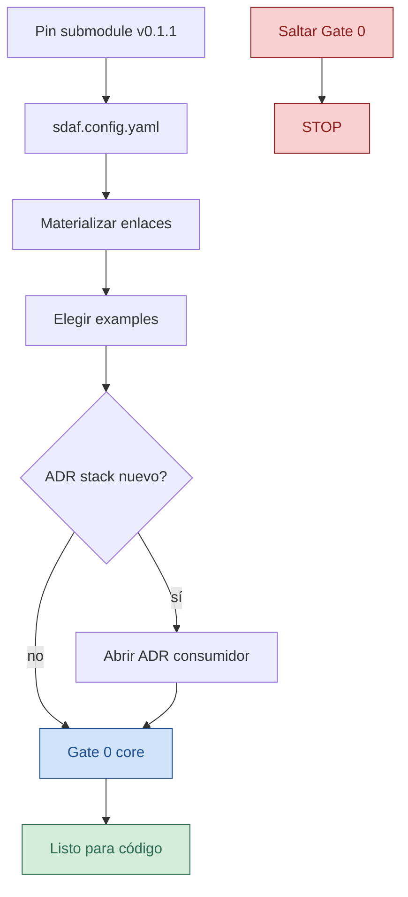

<!-- --8<-- [start:cuerpo] -->
# Adopción — sdaf-stack-dotnet@0.1.1

| Campo | Valor |
|--------|--------|
| Rol | 🛠️ HOWTO de adopción (no es constitución del método) |
| Pack | `sdaf-stack-dotnet@0.1.1` |
| Requiere | `sdaf-core@0.2.x` ya adoptado + Gate 0 del método vigente |

> [!NOTE]
> Esto es un **HOWTO**. No sustituye el handbook Approved ni la constitución de **sdaf-core**.

## En esta página

- [Flujo](#flujo)
- [Pasos](#pasos)
- [Prohibido](#prohibido)
- [Upgrade](#upgrade)
- [Relacionado](#relacionado)

## Flujo



## Pasos

1. Añadir este pack como submodule pinneado a tag `v0.1.1`, p. ej. en `sdaf-stack-dotnet/`:

```text
git submodule add <url-sdaf-stack-dotnet> sdaf-stack-dotnet
cd sdaf-stack-dotnet && git checkout v0.1.1
```

2. En la raíz del consumidor, `sdaf.config.yaml`:

```yaml
sdaf:
  version: "0.2.0"
stack:
  pack: sdaf-stack-dotnet@0.1.1
```

3. Materializar aportes del pack en la raíz del consumidor.

> [!TIP]
> Preferido: symlinks relativos (Git mode `120000`), no copias.

En repos de referencia (p. ej. [ShiftFlow-sdaf](https://github.com/Cyberdine-Systems-Corporation/ShiftFlow-sdaf)) hay un script documentado:

```powershell
git submodule update --init --recursive
git config core.symlinks true
.\scripts\materialize-submodules.ps1 -Force
```

El HOWTO vive en `docs/materializacion-submodules.md` del **consumidor**. Puedes copiar `scripts/materialize-submodules.ps1` / `.sh` al adoptar el pack; el manifesto incluye rutas del pack y del core.

**Fallback manual** (copiar o `ln -s` / `New-Item SymbolicLink`):

| Consumidor | Origen (relativo desde el padre del enlace) |
|------------|---------------------------------------------|
| `agents/frontend-agent.md`, `domain-application-agent.md`, `infrastructure-agent.md` | `../sdaf-stack-dotnet/agents/…` |
| `prompts/agents/` (mismos ids) | `../../sdaf-stack-dotnet/prompts/agents/…` |
| `skills/csharp-adr006-slice`, `blazor-bff-slice`, `aspire-local-run` | `../sdaf-stack-dotnet/skills/<id>` |
| `.cursor/rules/coding-standards-csharp.mdc` (opcional) | `../../sdaf-stack-dotnet/.cursor/rules/coding-standards-csharp.mdc` |

> [!WARNING]
> **No** usar junctions de Windows (`mklink /J`): Git no los modela como enlaces portables cross-platform.

Materializar también skills/agentes/prompts del **core** según [`sdaf-core` docs/adopcion-y-upgrade.md](https://github.com/Cyberdine-Systems-Corporation/sdaf-core/blob/main/docs/adopcion-y-upgrade.md).

4. Elegir escenario de `examples/`:

| Escenario | Uso |
|-----------|-----|
| `01-pack-only.yaml` | Playbooks sin cambiar activos del core |
| `02-pack-frontend.yaml` | Activa `domain-application` + `frontend` |

5. Si el runtime/UI/BD se fijan por primera vez: abrir **ADR** en el consumidor (el pack no sustituye esa decisión).

6. Antes de código de producto: skill `sdaf-gate0` del core.

## Prohibido

> [!CAUTION]
> ⛔ No continues si pretendes declarar este pack como constitución o saltar Gate 0.

- Declarar este pack como constitución del método.
- Saltar Gate 0 “porque hay skill csharp”.
- Meter dominio o specs de un producto dentro del pack.

## Upgrade

Al subir el tag del pack:

1. Actualizar pin del submodule, `stack.pack` semver, y citas `skill@version` en worklogs nuevos.
2. Volver a ejecutar el script de materialización del consumidor (`-Force` / `--force` si cambió el árbol).
3. No auto-migrar specs del consumidor.

<!-- --8<-- [end:cuerpo] -->

## Relacionado

| | Destino | Por qué |
|--|---------|---------|
| 🧭 | [README.md](README.md) | Hub y tres puertas |
| 📦 | [examples/](examples/) | Escenarios de configuración |
| 🛠️ | [skills/README.md](skills/README.md) | Skills a materializar |
| 🧭 | [docs/navegacion-docs.md](docs/navegacion-docs.md) | Mapa de clics del pack |
| 📝 | [docs/checklist-pagina-docs.md](docs/checklist-pagina-docs.md) | DoD de página markdown |
| 📦 | [pack.yaml](pack.yaml) | Manifest canónico |
