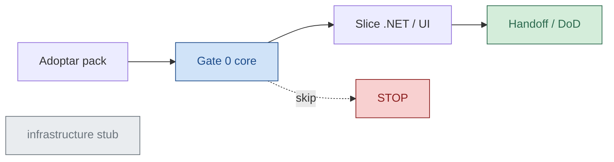

# sdaf-stack-dotnet

`sdaf-stack-dotnet@0.1.1` — pack de stack SDAF para **.NET / Blazor / Aspire**.

| Campo | Valor |
|--------|--------|
| Id | `sdaf-stack-dotnet@0.1.1` |
| Compat | `sdaf-core` **>=0.2.0 &lt;0.3.0** |
| Contrato | [sdaf-core `docs/contrato-pack-stack.md`](https://github.com/Cyberdine-Systems-Corporation/sdaf-core/blob/v0.2.0/docs/contrato-pack-stack.md) |
| Rol | Índice / hub del pack (no es constitución del método) |

> [!NOTE]
> Este repositorio es un **overlay técnico**. La constitución y el handbook Approved viven en **sdaf-core**. Este pack no los sustituye.

> [!IMPORTANT]
> Gate 0 del core manda sobre cualquier skill de implementación de este pack.

## En esta página

- [Tres puertas](#tres-puertas)
- [Qué aporta](#qué-aporta)
- [Qué no es](#qué-no-es)
- [Árbol del pack](#árbol-del-pack)
- [Flujo típico](#flujo-típico)
- [Familia sdaf-stack](#familia-sdaf-stack-)
- [Licencia](#licencia)
- [Relacionado](#relacionado)

## Tres puertas

| Puerta | Destino | Para quién |
|--------|---------|------------|
| 🛠️ Adoptar el pack | [ADOPT.md](ADOPT.md) | Quien materializa submodule, `sdaf.config.yaml` y enlaces |
| 📖 Entender contratos | [agents/README.md](agents/README.md) · [playbooks/README.md](playbooks/README.md) | Quien aplica norma del overlay (constitución = sdaf-core) |
| 🛠️ Operar el día a día | [skills/README.md](skills/README.md) | Quien ejecuta slices, UI/BFF o runtime local |

🧭 Mapa de clics y vocabulario visual: [docs/navegacion-docs.md](docs/navegacion-docs.md). DoD de página: [docs/checklist-pagina-docs.md](docs/checklist-pagina-docs.md).

## Qué aporta

| Tipo | Artefactos |
|------|------------|
| 📦 Skills | [`csharp-adr006-slice`](skills/csharp-adr006-slice/SKILL.md), [`blazor-bff-slice`](skills/blazor-bff-slice/SKILL.md), [`aspire-local-run`](skills/aspire-local-run/SKILL.md) |
| Contratos | [`frontend`](agents/frontend-agent.md), [`domain-application`](agents/domain-application-agent.md), [`infrastructure`](agents/infrastructure-agent.md) (stub) |
| Playbooks | [`coding-standards-csharp`](playbooks/coding-standards-csharp.md), [`vertical-slice-cqrs`](playbooks/vertical-slice-cqrs.md) |
| IDE | [`.cursor/rules/coding-standards-csharp.mdc`](https://github.com/Cyberdine-Systems-Corporation/sdaf-stack-dotnet/blob/main/.cursor/rules/coding-standards-csharp.mdc) |
| Ejemplos | [`examples/`](docs/adoption/escenarios.md) |
| 🛠️ Sitio navegable | `mkdocs/mkdocs.yml` — ver [`docs/uso-local.md`](docs/uso-local.md) |

## Qué no es

> [!WARNING]
> No declares este pack como constitución del método. No metas dominio ni specs de un producto aquí.

- No es un producto ni una solución `.sln`.
- No sustituye ADRs de stack del consumidor.
- No redefine specification / architecture / testing-review del core.
- No contiene `specs/` ni `knowledge/` de dominio.

## Árbol del pack

```text
sdaf-stack-dotnet/
├── README.md                 ← hub (esta página)
├── ADOPT.md                  ← HOWTO adopción
├── pack.yaml                 ← manifest @0.1.1
├── CHANGELOG.md
├── docs/                     ← HOWTO sitio + arquitectura del pack
│   ├── navegacion-docs.md
│   └── checklist-pagina-docs.md
├── mkdocs/                   ← Material + symlinks a fuentes canónicas
├── agents/                   ← contratos de extensión
├── prompts/agents/           ← prompts de sistema
├── playbooks/                ← norma técnica del stack
├── skills/                   ← playbooks operativos por skill
├── examples/                 ← escenarios sdaf.config
└── .cursor/rules/            ← regla IDE fina C#
```

## Flujo típico



> [!TIP]
> Empieza por [ADOPT.md](ADOPT.md), pin a tag `v0.1.1`, y elige un escenario en [`examples/`](docs/adoption/escenarios.md).

## Familia sdaf-stack-*

Otros packs (node, etc.) deben repetir este patrón: `pack.yaml`, agentes solo de extensión, skills con prefijo de stack, `ADOPT.md`, sin producto. Este repo es el primer ejemplar.

## Licencia

MIT — ver [LICENSE](https://github.com/Cyberdine-Systems-Corporation/sdaf-stack-dotnet/blob/main/LICENSE).

## Relacionado

| | Destino | Por qué |
|--|---------|---------|
| 🛠️ | [ADOPT.md](ADOPT.md) | Pasos de adopción y upgrade |
| 🛠️ | [skills/README.md](skills/README.md) | Catálogo operativo |
| 🧭 | [docs/navegacion-docs.md](docs/navegacion-docs.md) | Vocabulario visual y mapa de clics |
| 📝 | [docs/checklist-pagina-docs.md](docs/checklist-pagina-docs.md) | DoD de PRs que tocan markdown |
| 🛠️ | [docs/uso-local.md](docs/uso-local.md) | Levantar el sitio MkDocs en local |
| ✅ | [CHANGELOG.md](https://github.com/Cyberdine-Systems-Corporation/sdaf-stack-dotnet/blob/main/CHANGELOG.md) | Historial de versiones del pack |
| 📦 | [pack.yaml](https://github.com/Cyberdine-Systems-Corporation/sdaf-stack-dotnet/blob/main/pack.yaml) | Manifest canónico |
