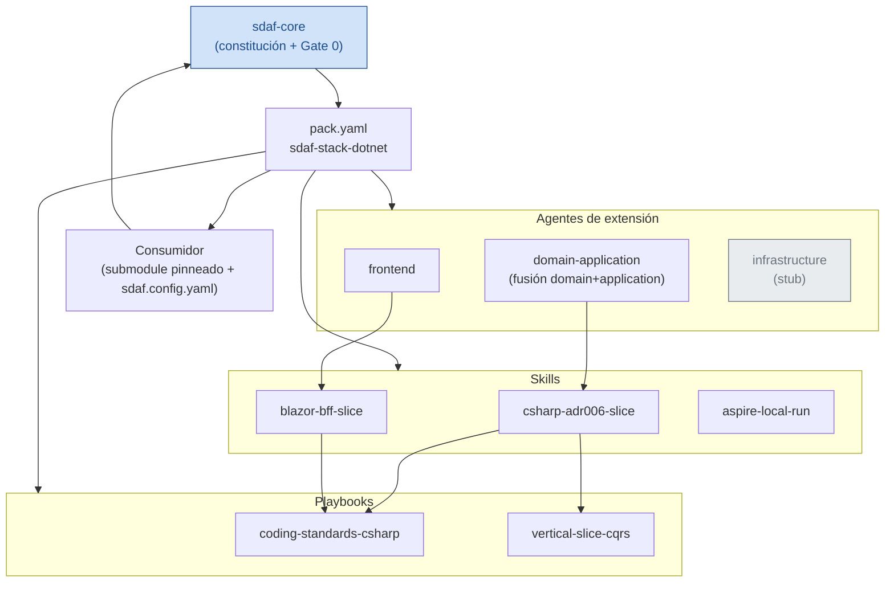

# Relación de componentes

## Lectura del diagrama

- `sdaf-core` manda sobre Gate 0 y el handbook Approved; el pack nunca lo sustituye.
- `pack.yaml` es el manifest que declara qué agentes, skills y playbooks aporta este overlay.
- `infrastructure` está marcado como **stub**: solo se activa bajo demanda humana explícita (ver [ADR-0002](adr/0002-infrastructure-stub.md)).
- El **consumidor** materializa el pack (symlinks, no copias) y vuelve a cerrar el ciclo contra `sdaf-core` en cada PBI.

## Relacionado

| Destino | Por qué |
|---------|---------|
| [Arquitectura](index.md) | Árbol del pack y contrato con sdaf-core |
| [ADR](adr/index.md) | Por qué domain+application está fusionado y por qué infrastructure es stub |
| [Adopción](../adoption/index.md) | Cómo se materializa este grafo en un consumidor |
