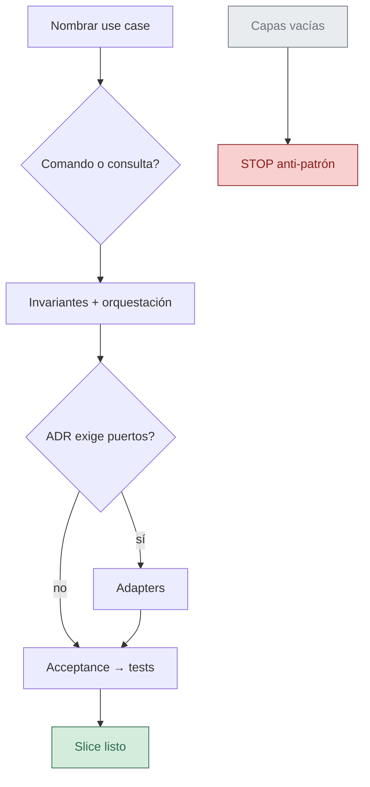

<!-- --8<-- [start:cuerpo] -->
# Playbook — Vertical slice + CQRS (aplicación)

| Campo | Valor |
|--------|--------|
| Rol | 📖 Playbook / norma técnica de stack |
| Versión | 0.1.1 |
| Pack | sdaf-stack-dotnet@0.1.1 |
| Estado | Approved |
| Fecha | 2026-08-25 |

> [!NOTE]
> Norma del overlay para estructurar el PBI. No sustituye specs Approved ni ADRs del consumidor.

## En esta página

- [Idea](#idea)
- [Pasos conceptuales](#pasos-conceptuales)
- [Anti-patrones](#anti-patrones)
- [Relacionado](#relacionado)

## Idea

Un PBI In se entrega como **vertical slice**: un caso de uso (comando o consulta) atraviesa los límites necesarios sin montar capas vacías “para el futuro”.

**CQRS ligero:** separar comando (cambia estado) vs consulta (lee) cuando aporte claridad — no un bus de mensajería obligatorio.

## Pasos conceptuales

| Paso | Acción |
|------|--------|
| 1 | Nombrar el use case desde la spec de aplicación. |
| 2 | Separar comando vs consulta cuando aporte claridad (CQRS ligero). |
| 3 | Invariantes de dominio cerca del modelo; orquestación en aplicación. |
| 4 | Puertos/adapters solo si el ADR de infraestructura lo exige (el agente infrastructure es stub en 0.1.x). |
| 5 | Acceptance → tests antes o junto al código (Test from Specs). |

## Anti-patrones

> [!WARNING]
> Evita estos patrones; bloquean un slice trazable.

| Anti-patrón | Por qué |
|-------------|---------|
| God services que mezclan todos los PBI | Pierdes trazabilidad PBI → slice |
| Exponer el modelo de dominio crudo por HTTP sin DTO/contrato | Rompe límites acordados |
| UI que reimplementa reglas hard de dominio | Duplica norma fuera del slice |

<!-- --8<-- [end:cuerpo] -->

## Relacionado

| Destino | Por qué |
|---------|---------|
| [../skills/csharp-adr006-slice/SKILL.md](../skills/csharp-adr006-slice/SKILL.md) | Skill asociada `csharp-adr006-slice@0.1.1` |
| [coding-standards-csharp.md](coding-standards-csharp.md) | Estándares C# del pack |
| [../agents/domain-application-agent.md](../agents/domain-application-agent.md) | Contrato que aplica este playbook |
| [../README.md](../README.md) | Hub del pack |
