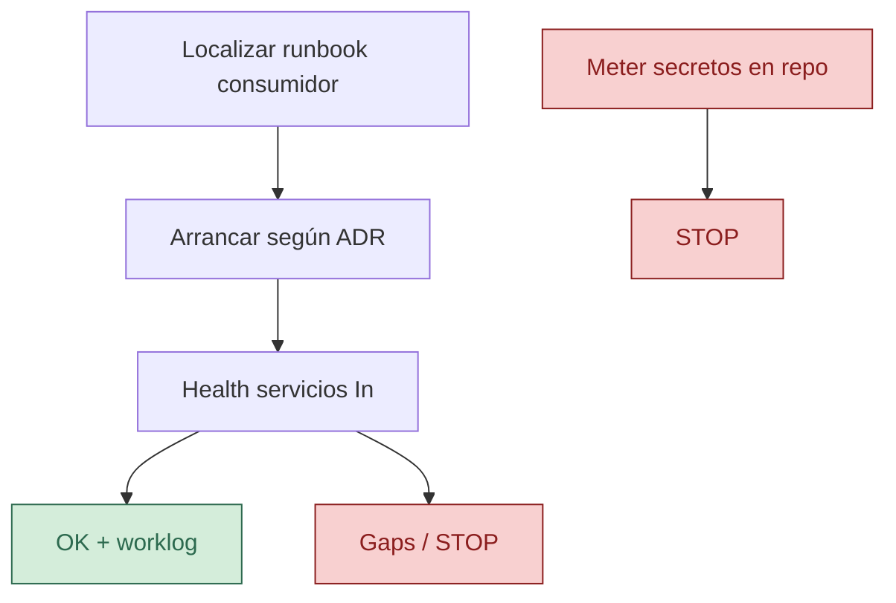

# aspire-local-run

| Campo | Valor |
|--------|--------|
| Rol | 🛠️ Skill / HOWTO operativo |
| ID | aspire-local-run |
| Versión | 0.1.1 |
| Estado | Approved |
| Prioridad | media |
| Fecha | 2026-08-25 |
| Pack | sdaf-stack-dotnet@0.1.1 |
| Norma | Gate 2 (sdaf-core H05), runbook `docs/` del consumidor |

> [!NOTE]
> HOWTO de runtime local. **Gate 2** = validación de entorno/runtime del método (definido en sdaf-core). No impone Aspire si el ADR del consumidor eligió otro runtime.

## En esta página

- [Disparadores](#disparadores)
- [Pasos](#pasos)
- [Definition of Done](#definition-of-done)
- [Restricciones](#restricciones)
- [Relacionado](#relacionado)
- [Historial](#historial)

## Disparadores

- “¿Arranca en local?”, Gate 2.5, onboarding de runtime.
- Cambios que afecten AppHost / compose local.

## Pasos

1. Localizar el runbook del consumidor (`docs/` o README) — no inventar topología.
2. Arrancar según el ADR/runtime acordado (Aspire AppHost u otro documentado).
3. Comprobar health básico de los servicios In del MVP.
4. Si falla: listar gaps (config, secretos ausentes, puertos); no “arreglar” saltándose specs.
5. Registrar `aspire-local-run@0.1.1` y resultado en worklog.

## Definition of Done

- [ ] ✅ Comando/pasos de arranque citados
- [ ] ✅ Resultado OK o STOP con evidencias
- [ ] ✅ Worklog actualizado

## Restricciones

> [!CAUTION]
> ⛔ No introducir secretos en el repo.

No imponer Aspire si el ADR del consumidor eligió otro runtime: entonces documentar N/A y usar el runbook real. El nombre “aspire” es el playbook por defecto del pack; el consumidor manda.

## Relacionado

| Destino | Por qué |
|---------|---------|
| [../README.md](../README.md) | Índice de skills |
| [../../ADOPT.md](../../ADOPT.md) | Adopción del pack / entorno |
| [../../README.md](../../README.md) | Hub del pack |

## Historial

| Versión | Fecha | Cambio |
|---------|--------|--------|
| 0.1.0 | 2026-08-25 | Primera versión del pack |
| 0.1.1 | 2026-09-17 | Alineación pack@0.1.1; Relacionado/Mermaid |
