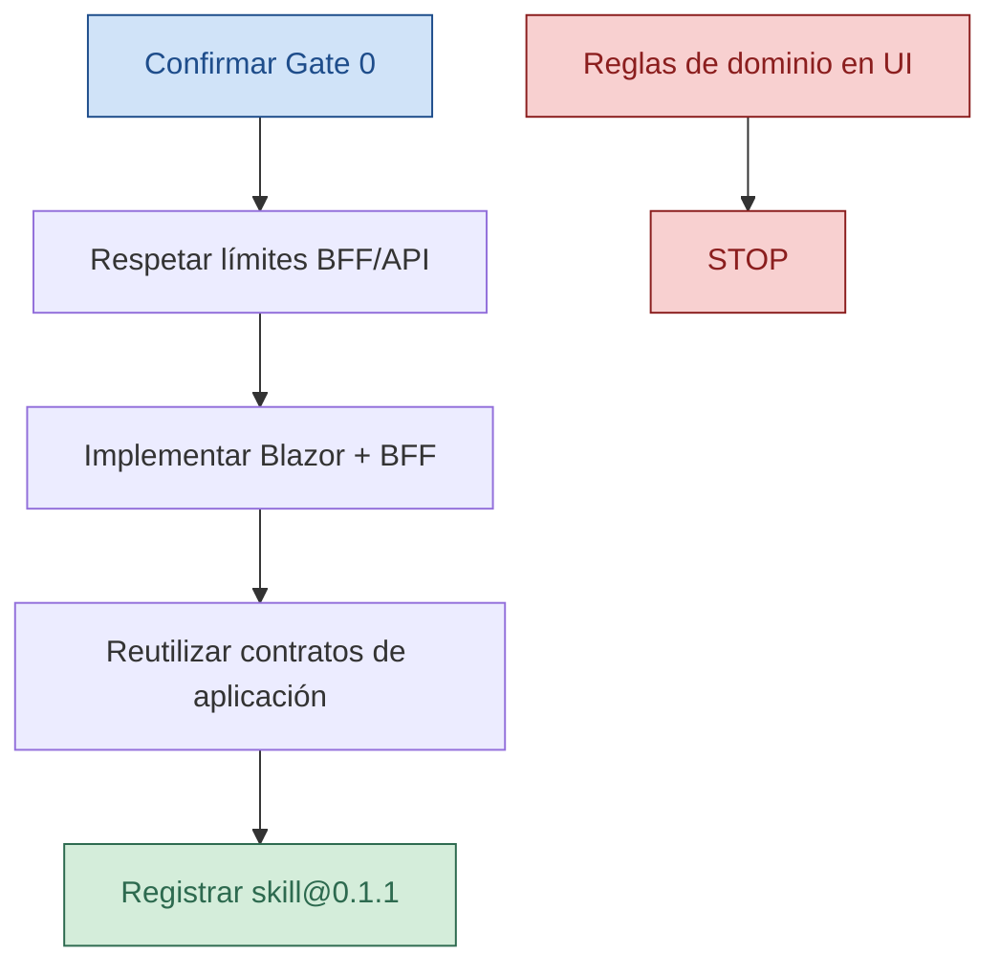

<!-- --8<-- [start:cuerpo] -->
# blazor-bff-slice

| Campo | Valor |
|--------|--------|
| Rol | 🛠️ Skill / HOWTO operativo |
| ID | blazor-bff-slice |
| Versión | 0.1.1 |
| Estado | Approved |
| Prioridad | alta |
| Fecha | 2026-08-25 |
| Pack | sdaf-stack-dotnet@0.1.1 |
| Norma | playbooks/coding-standards-csharp.md, ADRs UI/API del consumidor, Gate 0 |

> [!NOTE]
> HOWTO de UI/BFF. **BFF** = Backend-for-Frontend: capa API orientada a la UI, no al dominio expuesto crudo.

## En esta página

- [Disparadores](#disparadores)
- [Pasos](#pasos)
- [Definition of Done](#definition-of-done)
- [Restricciones](#restricciones)
- [Relacionado](#relacionado)
- [Historial](#historial)

## Disparadores

- PBI de pantalla/flujo UI; “añadir BFF endpoint para la UI”.
- Agente `frontend` activo.

## Pasos

1. Confirmar Gate 0 y acceptance UI.
2. Respetar límites BFF/API del ADR del consumidor (no llamar dominio desde el browser si el ADR lo prohíbe).
3. Implementar componentes/páginas Blazor y endpoints BFF necesarios en `src_path`.
4. Reutilizar contratos ya expuestos por el slice de aplicación; no duplicar reglas de negocio en la UI.
5. Citar `blazor-bff-slice@0.1.1` en worklog; handoff a testing-review.

## Definition of Done

- [ ] ✅ Flujo UI del In observable según acceptance
- [ ] ✅ Sin lógica de dominio nueva en la UI
- [ ] ✅ Worklog cerrado

## Restricciones

> [!WARNING]
> ⛔ No Gate 0 skip; no secretos en cliente.

Framework concreto lo fija el ADR del consumidor (este skill asume Blazor como playbook del pack).

<!-- --8<-- [end:cuerpo] -->

## Relacionado

| | Destino | Por qué |
|--|---------|---------|
| 🧭 | [../../agents/frontend-agent.md](../../agents/frontend-agent.md) | Contrato que invoca esta skill |
| 📖 | [../../playbooks/coding-standards-csharp.md](../../playbooks/coding-standards-csharp.md) | Estándares C# |
| 🧭 | [../README.md](../README.md) | Índice de skills |

## Historial

| Versión | Fecha | Cambio |
|---------|--------|--------|
| 0.1.0 | 2026-08-25 | Primera versión del pack |
| 0.1.1 | 2026-09-17 | Alineación pack@0.1.1; TOC/Relacionado/Mermaid |
