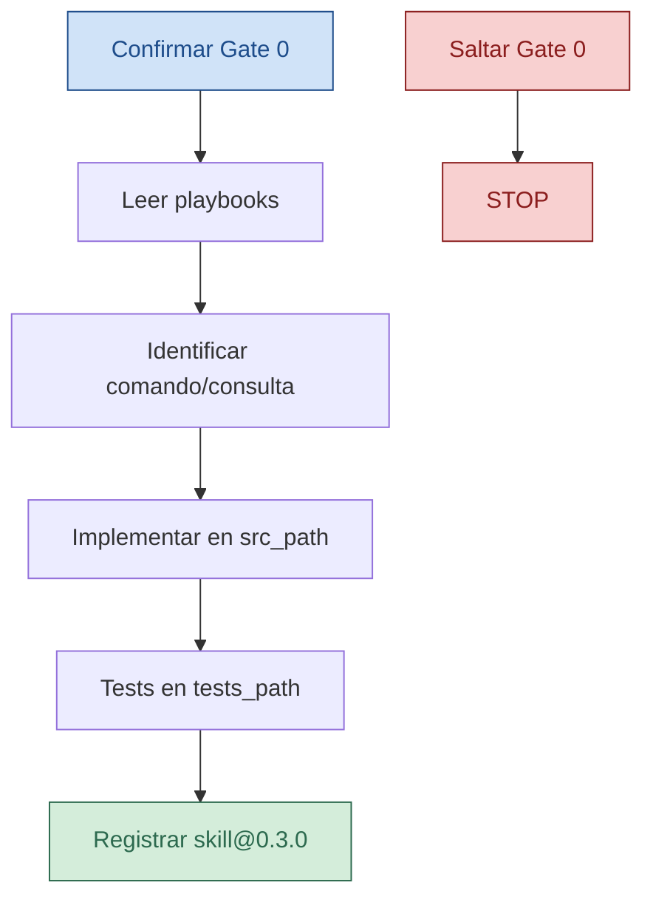

<!-- --8<-- [start:cuerpo] -->
# csharp-adr006-slice

| Campo | Valor |
|--------|--------|
| Rol | 🛠️ Skill / HOWTO operativo |
| ID | csharp-adr006-slice |
| Versión | 0.3.0 |
| Estado | Approved |
| Prioridad | alta |
| Fecha | 2026-09-25T09:01+02:00 |
| Pack | sdaf-stack-dotnet@0.3.0 |
| Norma | playbooks/vertical-slice-cqrs.md, playbooks/coding-standards-csharp.md, Gate 0 (sdaf-core); handoff a testing-review (core 0.3) |

> [!NOTE]
> HOWTO de implementación. No sustituye playbooks Approved ni Gate 0 del core.

## En esta página

- [Disparadores](#disparadores)
- [Pasos](#pasos)
- [Definition of Done](#definition-of-done)
- [Restricciones](#restricciones)
- [Relacionado](#relacionado)
- [Historial](#historial)

## Disparadores

- “Implementar slice de API/aplicación”, PBI backend tras Architecture.
- Agente `domain-application` activo.

## Pasos

1. Confirmar Gate 0 y specs Approved del PBI.
2. Leer playbooks `vertical-slice-cqrs` y `coding-standards-csharp`.
3. Identificar comando/consulta, invariantes y acceptance del slice.
4. Implementar en el layout del consumidor (`src_path`): aplicación (+ dominio si la fusión lo exige) sin filtrar detalles de UI.
5. Añadir o ajustar tests en `tests_path` derivados de acceptance.
6. Registrar `csharp-adr006-slice@0.3.0` en worklog; handoff a frontend o testing-review.

## Definition of Done

- [ ] ✅ Slice In sin alcance Out
- [ ] ✅ Tests de acceptance del slice en verde o gap documentado
- [ ] ✅ Worklog actualizado

## Restricciones

> [!WARNING]
> ⛔ No saltar Gate 0; no aprobar specs/ADR. No meter nombres de producto ajenos ni secretos.

El “ADR-006” del id es histórico de naming; el ADR vigente es el del **consumidor**.

<!-- --8<-- [end:cuerpo] -->

## Relacionado

| | Destino | Por qué |
|--|---------|---------|
| 📖 | [../../playbooks/vertical-slice-cqrs.md](../../playbooks/vertical-slice-cqrs.md) | Norma del slice |
| 📖 | [../../playbooks/coding-standards-csharp.md](../../playbooks/coding-standards-csharp.md) | Estándares C# |
| 🧭 | [../../agents/domain-application-agent.md](../../agents/domain-application-agent.md) | Contrato que invoca esta skill |
| 🧭 | [../README.md](../README.md) | Índice de skills |

## Historial

| Versión | Fecha | Cambio |
|---------|--------|--------|
| 0.1.0 | 2026-08-25 | Primera versión del pack |
| 0.1.1 | 2026-09-17 | Alineación pack@0.1.1; TOC/Relacionado/Mermaid |
| 0.2.0 | 2026-09-19 | Compat sdaf-core 0.3.x; pack@0.2.0 |
| 0.3.0 | 2026-09-25T09:01+02:00 | Compat sdaf-core 0.4.x; pack@0.3.0. Sin cambio de norma. |
